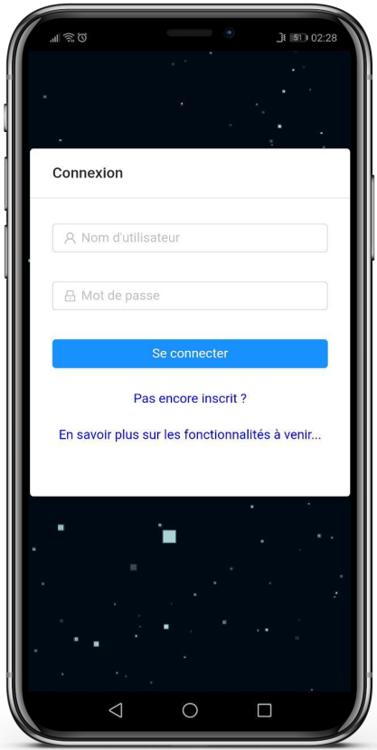
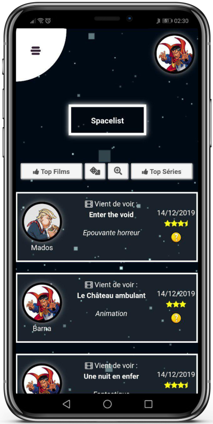
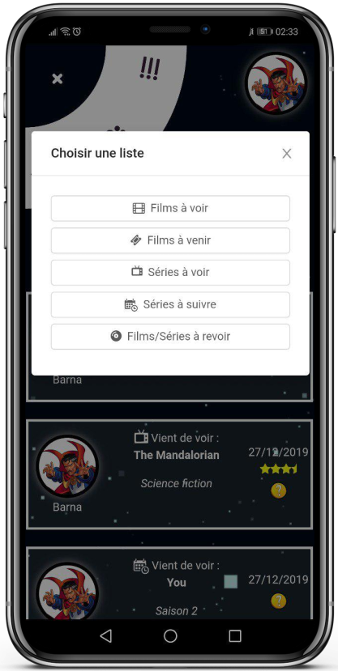
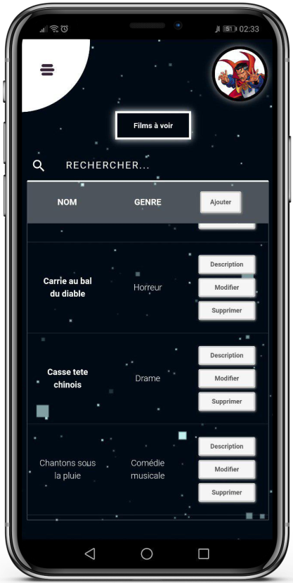
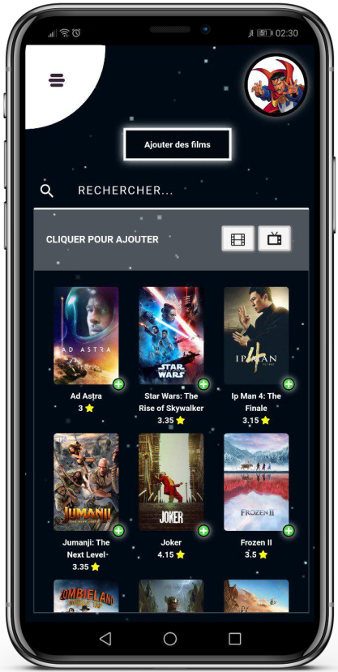
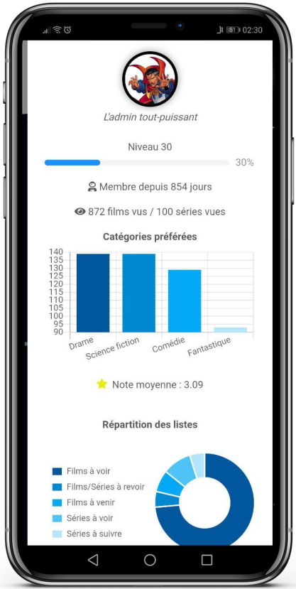
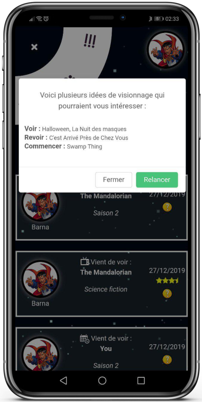
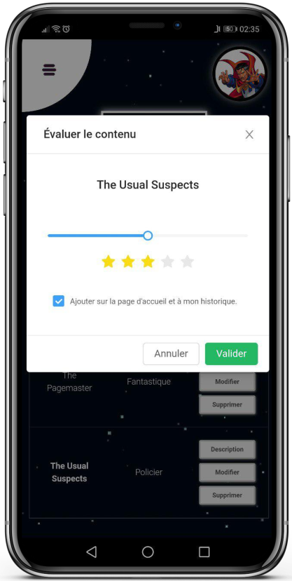
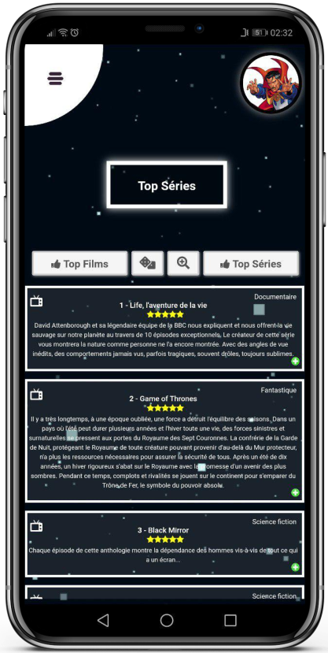

## <b>Spacelist</b>

Spacelist est une application mobile et desktop que j’ai réalisé en 2018.   
C’est un gestionnaire communautaire de listes d'œuvres cinématographiques et audiovisuelles dont voici les principales fonctionnalités :

  
Cette application est composée d’un client en JavaScript (React) qui interroge une API en PHP. Les données sont stockées dans une base de données MySQL. L’API TMDB est utilisée pour les informations relatives aux films et aux séries. La version desktop de l’applicatif utilise Electron.
Pour des raisons de sécurité sur les appels à l’API, le code n’est pas public.   

(Août 2021) L'applicaton n'est plus accessible en ligne.
 
Quelques images de l'application :

    
    
    
    
    
    
    
    
    
    

